- title : Rise of ASP.NET Core
- description : 
- author : Jarosław Krefta, Paweł Jeliński
- theme : night
- transition : default

***

##Rise of ASP.NET Core
<br/>
<br/>
Jarosław Krefta<br/>
Paweł Jeliński

***

###Who do we work for?

---


---

###Aka " The Jetson team " :)
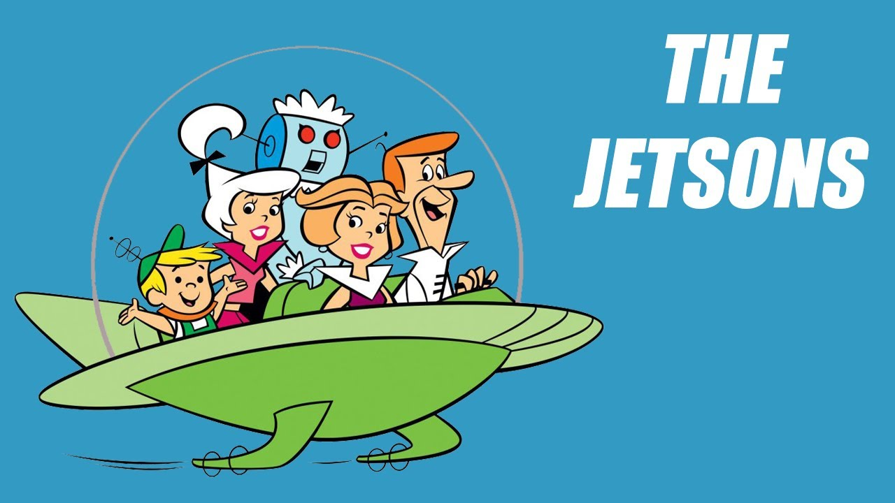

***

###Who are we?


***

###Jarosław Krefta

---

###Guess which one I am? :)
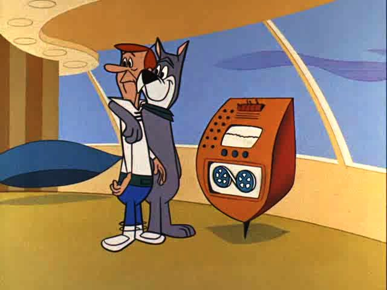

---

###Obviously!


***

###Paweł Jeliński

---

###How do I see Myself
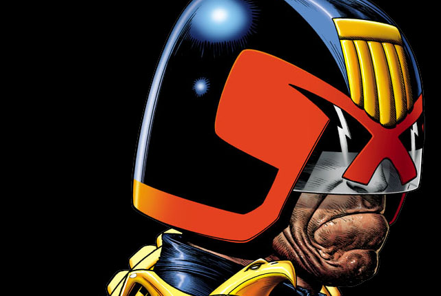

---

###How teammates see me


---

###To be more exact


*** 

###What are we not going to talk about
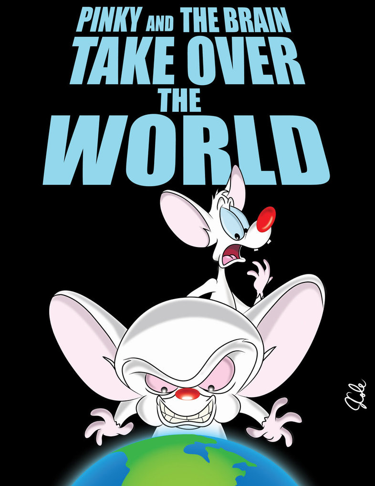

--- 

###We are not going to sell you anything
###.Net is not a " Golden Hammer "

--- 

###What are we going to talk about
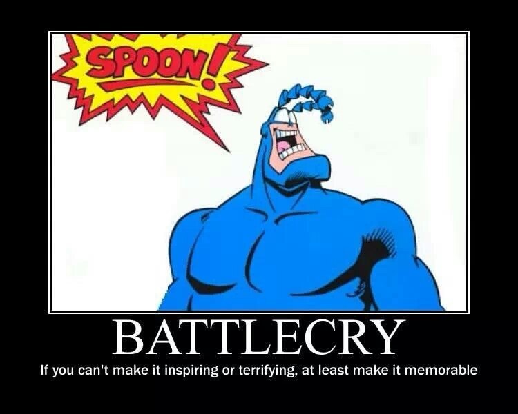

---

###Short history of ASP and friends :)

***  

###Lets go back to ...

***

##It`s 1996 ...

---

###Browsers are at war!


---

###PHP has power equal to potato


---

###Java just got released and has nothing


---

###ASP CLASSIC gets released


---

####ASP Classic is Microsoft's first server-side script engine for dynamically generated web pages
* Scripting via Virtual Basic (Yes! Not Visual!)
* Addon for IIS
* Supports JScript
* Supports COM modules
* Supports ActiveX(PearlScript)
* Runs on Windows NT 4.0

---
```vb 
<html>
<body>

<%
    Dim x(1,1)
    x(0,0)="Volvo"
    x(0,1)="BMW"
    x(0,2)="Ford"
    x(1,0)="Apple"
    x(1,1)="Orange"
    for i=0 to 1
        response.write("<p>")
        for j=0 to 1
            response.write(x(i,j) & "<br />")
        next
        response.write("</p>")
    next
%>

</body>
</html>
```

---

###Other notable facts
* Release of **IIS 3.0**
* Release of **Internet Explorer 3.0**
* First release of **JScript**
* First release of **ActiveX**

---

####Internet explorer starts getting noticed! (10% of market)
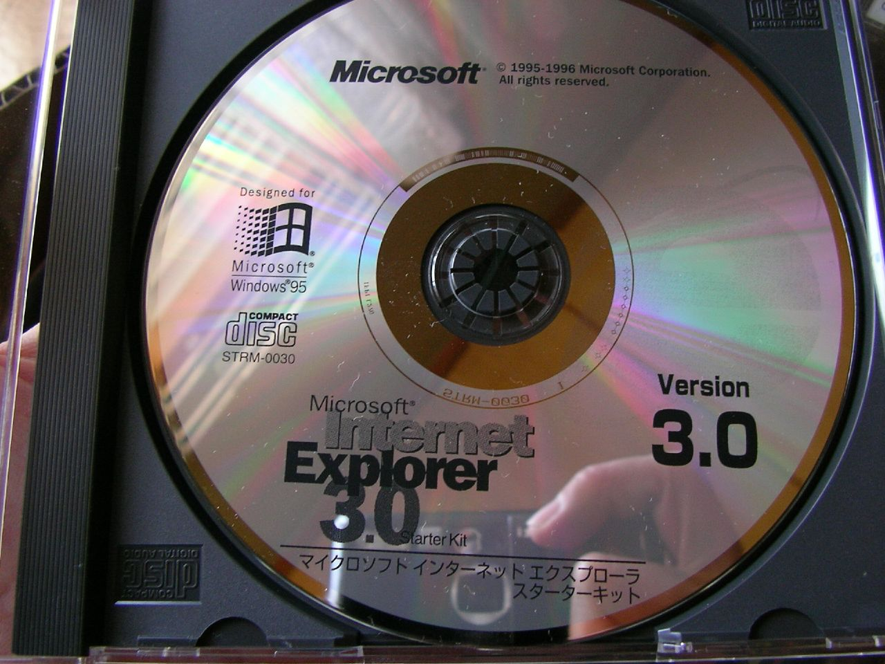

---

###Great Success!


***

##It`s 1997

---

###New project gets started!

---

###XSP / ASP+
_"We originally called it XSP; and people would always ask what the X stood for. At the time it really didn't stand for anything. XML started with that; XSLT started with that. Everything cool seemed to start with an X, so that's what we originally named it. In the first six months, we didn't use .NET. The CLR didn't exist—it was just starting around the same time we were—so, we were doing most of our prototyping in C++, JavaScript, and ActiveScript script engines. We knew we wanted an object-oriented environment, and we really liked the characteristics a managed programming model provided in terms of garbage collection, nice encapsulation, and object-orientation techniques..._

---

_... We actually started writing production code in C++, though, because at the time we didn't really have a good runtime platform on which to build. We got about two weeks into it when we met up with the CLR team; at the time that team had no partners inside the company building on top of them. The only compiler they had was this thing called "simple managed C," which we affectionately called "smack." We ended up saying, "Maybe we should build on this." It was a huge risk, and at the time our team consisted of three or four people total. We were allowed to take a bet on it mainly because nobody really cared if we failed. Thankfully, we did and it paid off in a huge way. The rest is history, so to speak."_

___Scott Guthrie, co creator of ASP.NET___

---

####There actually was a book on ASP+ released in 2000


---

### Other notable facts

---

###First release of EcmaScript!


---

###Emergence of new world wide web standard: HTML 4.0


---

###Java releases servlets


***

##It`s 1998

---

###ASP CLASSIC 3.0 - last of it`s kind :)
' Last release was in 2000
' Will be supported until 2025

---

###Google is born
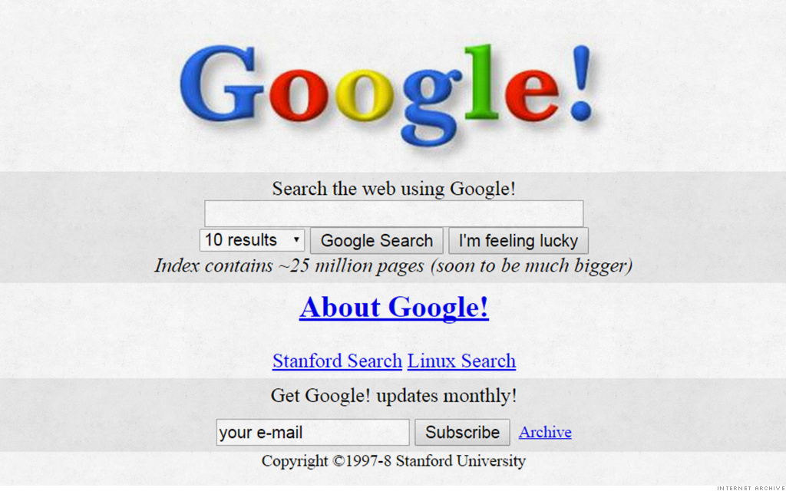

---

###Macromedia released Flash 


' Internet exploded with Flash movies and games
' First truly active frontend
' Could not communicate between separate flash clips

---

###Internet after release of Flash


---

###Micrsoft after release of Flash


---

###What Flash promised


---

###What Flash delivered


' Required heavy loading
' Did not always run
' Required plugin in browser
' Was abused by community

***

##1999 - 2003

---

###ASP.NET 1.0/1.1 gets released


' Good old ASP in new managed version
' Garbage collector does not impound scaling :)
' This is WebForms
' Same architecture as WinForms
' Event driven architecture
' Upfront and code behind approach to design web application

---

###Cassini. First .net self hosted server


' Required by .Net 1.0
' Obsolete from .Net 1.1
' Lived until 2008 as a part of VisualStudio
' Modified by community 
 
---

###Internet Explorer has won browser wars!


---

###Emergence of new world wide web standards:
' World wide web wanted more extensibility

---

###Ajax!
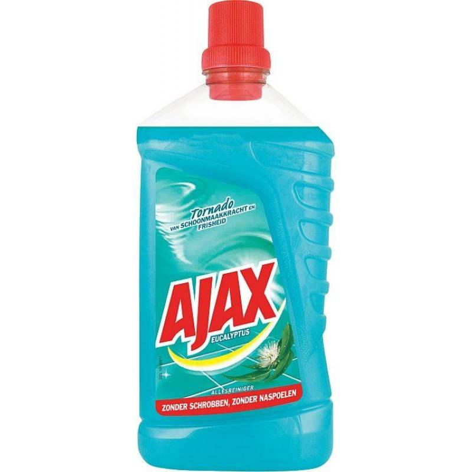

---

###I mean ...


---

###New HTML standard
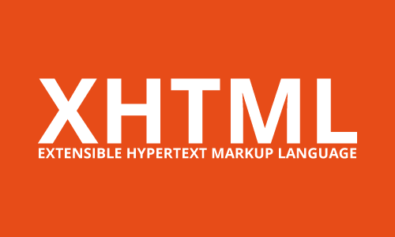


---

###Pimp my HTML


***

##It`s 2004

---

### Notable Microsoft releases

---

###There is literaly nothing from Microsoft


***

##It`s 2005

---

###Microsoft realizes that they need to get their "stuff" together


---

###So to make it up to web developers ...

---

###ASP.NET 2.0 gets released!
* Full support of ECMA standard
* Generic types
* Support for x64 CPU's

' Supports calls from frontend to backend

---

###Problem is ...

---

###Java gets first SpringMVC release!
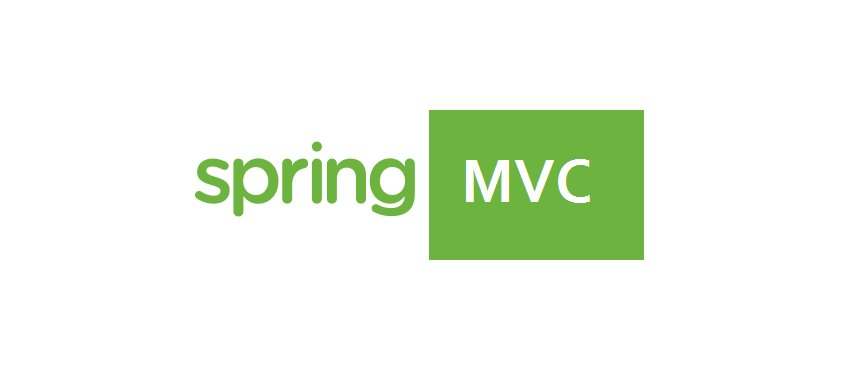

---

###PHP gets Cake!


***

##It`s 2006

---

###ASP.NET 3.0 gets released

' WPF was released
' WCF was released

---

###JQuery reaches version 1.0


' Frontend revolution
' Allowed for dynamic component rendering
' Encapsulated AJAX calls for all browsers
' Allowed HTML element theming

---

###Flash has reached its end of life


---

###Micrsoft after last release of Flash


' Microsoft was happy because they ware working on their own version

---

###Flash died! Lets release our own!


***

##It`s 2007

---

###SilverLight!


---

###Realy?


---

###Why do you release your own Flash!


' Silverlight was pipeline for in browser execution of .net code
' Used to write sidebar widgets
' Used ActiveX and COM controls
' Desktop like architecture
' Awfully slow
' Example of enterprise integration with legacy

---

###ASP.NET 3.5
###ASP.NET AJAX
###LINQ

---

###MVC CTP is released
####CTP = Current Technology Preview

' CTP - Community Technology Preview
' ASP.NET AJAX standardized handling of ajax calls

---

###Press X to JSON
Added support for JSON to WCF

***

##It`s 2008

---

###Chromium V8 engine


---

###New engine of internet
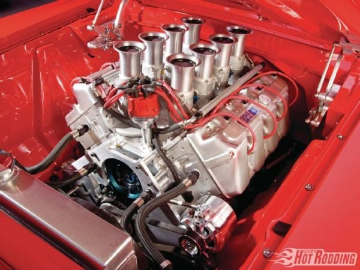

***

##It`s 2009

---

###MVC gets released
####It`s only 4 years late!

 

---

###Bing is born
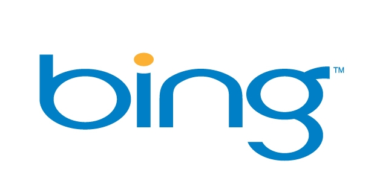

---

###Meanwhile ...

---

###EcmaScript5 and Node.Js emerges


---


***

##It`s 2010

---

###Release of ASP.NET 4.0 and WEB PAGES
 

---

###Google releases AngularJs


---

###Emergence of first full JavaScript stack!

---

####ExpressJs, KnockoutJs, Backbone, Underscore
####AND
####MEAN = MongoDb, ExpressJs, AngularJs, NodeJs

---

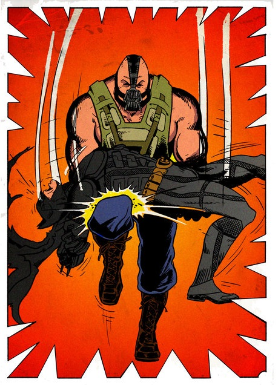 

***

##It`s 2011

---

###There is nothing from Microsoft


---

###... beside MVC 3 :)

***

##It`s 2012

---

###ASP.NET 4.5 & TPL


---

###Web Api gets extracted from MVC
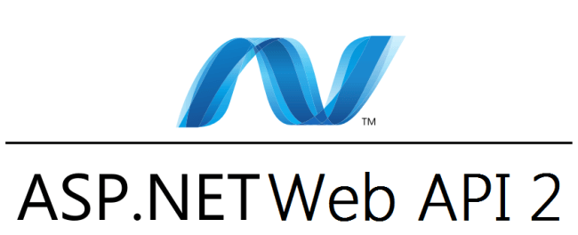

***

##It`s 2013

---

###Microsoft releases Chakra engine


---
###OWIN, Katana and SignalR
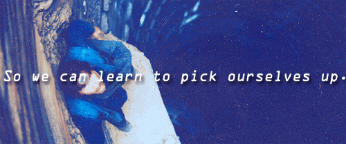

---

###Facebook invents React
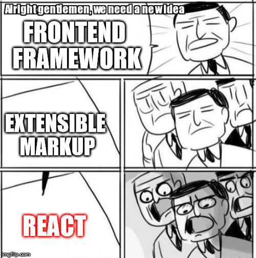

***

##It`s 2014

---


---


---

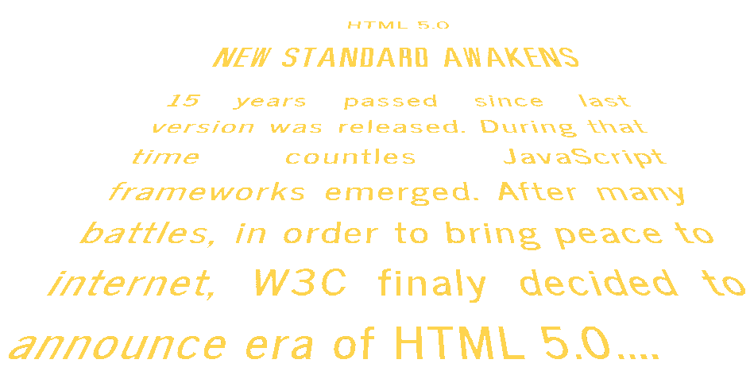

***

##It`s 2015

---

###ASP.NET Core RC

---

###EcmaScript 6


---

###Edge


---


---


---

- data-background: images/content/bluescreen.png

***

##It`s 2016

---

###ASP.NET Core 1.0


***

##It`s 2017

---

###ASP.Net Core 2.0


***

###Summary

---

https://www.techempower.com/benchmarks/

***

###How can we use this thing?

***

###Web application in 5 min :)

***

###Stack

* React + CerebralJs
* Kestrel + MediatR

***

###Pros and cons

* Pros:
    - decoupling
    - performance
    - easy to extend
    - flexible

* Cons:
    - celebration
    - heavily depends on MediatR and Container

***

###DEMO :)

***


***

###Useful links

* https://stackify.com/what-is-kestrel-web-server/
* https://thefreezeteam.azurewebsites.net/2015/08/10/building-mvc-jimmy-style/
* https://msdn.microsoft.com/en-us/library/bb266332.aspx
* https://www.youtube.com/watch?v=kej3YJDMAW4