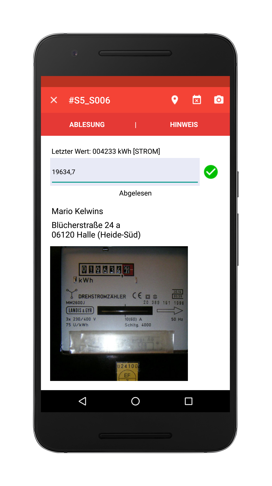

- title : Rise of ASP.NET Core
- description : 
- author : Jarosław Krefta, Paweł Jeliński
- theme : night
- transition : default

***

## Rise of ASP.NET Core

 
 

Jarosław Krefta
 
Paweł Jeliński

***

### Who are we?

***

### Jarosław Krefta

<!--  -->

***

### Paweł Jeliński

<!--  -->

*** 

### What are we not going to talk about

* something

--- 

### What are we going to talk about

* something

***  

###Lets go back to ...

***

##1996

---

###ASP CLASSIC
 
###IIS 3.0

---

###JScript
 
###ActiveX

***

##1997

---

###XSP / ASP+

---

###ECMA
 
###HTML 4.0

***

##1998

---

###ASP CLASSIC 3.0
 
###IIS 5.0

---

###Flash

***

##1999 - 2003

---

###ASP.NET 1.0 / 1.1
 
###IE 6

---

###Ajax
 
###XHTML

***

##2005

---

###ASP.NET 2.0

***

##2006

---

###ASP.NET 3.0

---

###JQuery

***

##2007

---

###ASP.NET 3.5
###SilverLight
###ASP.NET AJAX
###LINQ
###MVC CTP
###IE 7

***

##2008

---

###V8

***

##2009

---

###MVC
###IE 8

---

###Node.Js
###ES5

***

##2010

---

###ASP.NET 4.0
###WEB PAGES

---

###Angular
###Backbone
###Underscore
###WTF!!!

***

##2011

---

###MVC
###Razor
###IE 9

***

##2012

---

###ASP.NET 4.5

***

##2013

---

###OWIN / Katana
###SignalR
###IE 11

---

###React

***

##2014

---

###HTML 5
###Vue

***

##2015

---

###ASP.NET Core RC
###Chakra / Edge
###ES 6

***

##2016

---

###ASP.NET Core 1.0

***

##2017

---

###ASP.Net Core 2.0

***

###Now

***

###How can we use this thing?

***

###Web application in 5 min :)

***

###Stack

---

###Kestrel

---

###Mediator pattern

---

###Frontend 

***

###Journey of request

---

###Human

---

###React component

---

###Event calls Cerebral signal

---

###Cerebral calls chain

---

###Chain calls service

---

###Kestrel receives request

---

###Middleware

---

###Controller

---

###Mediator

---

###Handler

---

###Service

***

###Layers of separation - SOLID

***

###Pros and cons

***

###DEMO :)

***

###Improvements

---

###Interceptors

---

### Monads - Result & Option 

***

### Thank you!