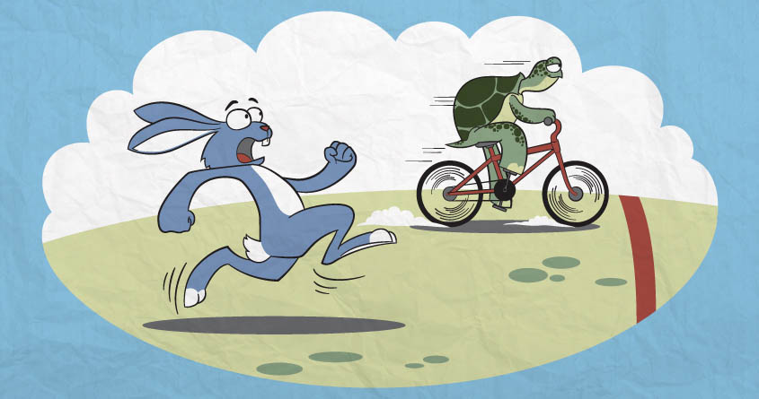

- title : Rise of ASP.NET Core
- description : 
- author : Jarosław Krefta, Paweł Jeliński
- theme : night
- transition : default

***

## Rise of ASP.NET Core

 
 

Jarosław Krefta
 
Paweł Jeliński

***

### Who do we work for?

---

---

### Aka " The Jetson team " :)

***

### Who are we?

***

### Jarosław Krefta

---

### Guess which one I am? :)

---

### Yes. Obviously!

---

### But 20 years later

***

### Paweł Jeliński

---

### How do I see Myself

---

### How teammates see me

---

### What does our boss see

---

### To be more exact

*** 

### What are we not going to talk about

--- 

### We are not going to sell you anything
### .Net is not a " Golden Hammer "

--- 

### What are we going to talk about

***  

###Lets go back to ...

***

##1996

---

###ASP CLASSIC

---

####ASP Classic is Microsoft's first server-side script engine for dynamically generated web pages
* Scripting via Virtual Basic (Yes! Not Visual!)
* Addon for IIS
* Supports JScript
* Supports COM modules
* Supports ActiveX(PearlScript)
* Runs on Windows NT 4.0
* Part of Windows Server 2000

---

    <html>
    <body>

    <%
        Dim x(1,1)
        x(0,0)="Volvo"
        x(0,1)="BMW"
        x(0,2)="Ford"
        x(1,0)="Apple"
        x(1,1)="Orange"
        for i=0 to 1
            response.write("
")
            for j=0 to 1
                response.write(x(i,j) & " ")
            next
            response.write("
")
        next
    %>

    </body>
    </html>

---

### Other notable facts
* Release of **IIS 3.0**
* Release of **Internet Explorer 3.0**
* First release of **JScript**
* First release of **ActiveX**

---

### Icon of the "Internet" 

---

### How to internet

***

##1997

---

###XSP / ASP+
_"We originally called it XSP; and people would always ask what the X stood for. At the time it really didn't stand for anything. XML started with that; XSLT started with that. Everything cool seemed to start with an X, so that's what we originally named it. In the first six months, we didn't use .NET. The CLR didn't exist—it was just starting around the same time we were—so, we were doing most of our prototyping in C++, JavaScript, and ActiveScript script engines. We knew we wanted an object-oriented environment, and we really liked the characteristics a managed programming model provided in terms of garbage collection, nice encapsulation, and object-orientation techniques..._

---

_... We actually started writing production code in C++, though, because at the time we didn't really have a good runtime platform on which to build. We got about two weeks into it when we met up with the CLR team; at the time that team had no partners inside the company building on top of them. The only compiler they had was this thing called "simple managed C," which we affectionately called "smack." We ended up saying, "Maybe we should build on this." It was a huge risk, and at the time our team consisted of three or four people total. We were allowed to take a bet on it mainly because nobody really cared if we failed. Thankfully, we did and it paid off in a huge way. The rest is history, so to speak."_

___Scott Guthrie, co creator of ASP.NET___

---

####There actually was a book on ASP+ released in 2000

---

### Other notable facts

---

###First release of ECMA Script Standard

---

###Emergence of new world wide web standard: HTML 4.0

***

##1998

---

### Notable Microsoft releases
* ASP CLASSIC 3.0 - last of it`s kind :)
* IIS 5.0 - released with new ASP

---

###Flash

---

### Internet after release of Flash

---

### Micrsoft after release of Flash

---

###What Flash promised

---

###What Flash delivered

***

##1999 - 2003

---

### ASP.NET 1.0 / 1.1

---

---

### Emergence of new world wide web standards:
* Ajax
* XHTML

World wide web wanted more extensibility

---

###XHTML - pimp my HTML

***

##2004

---

### Notable Microsoft releases

---

### ...

---

### There is literaly nothing from Microsoft

***

##2005

---

### Microsoft realizes that they need to get their "stuff" together

---

### So to make it up to web developers ...

---

### ASP.NET 2.0
* Full support of ECMA standard
* Generic types
* Support for x64 CPU's

***

##2006

---

###ASP.NET 3.0

---

---

### Micrsoft after last release of Flash

---

### Lets make our own!

***

##2007

---

### SilverLight! Yeaaaah!

---

---

---

###ASP.NET 3.5
###SilverLight
###ASP.NET AJAX
###LINQ
###MVC CTP
###IE 7

---
###Press X to JSON
Added support for JSON and POX to WCF

***

##2008

---

###Chromium V8 engine

---

###New engine of internet

***

##2009

---

###MVC
###IE 8

---

###Emergence of EcmaScript5 and Node.Js

---

***

##2010

---

###ASP.NET 4.0 and WEB PAGES
 

---

###Angular
 

---

### ExpressJs, KnockoutJs, Backbone, Underscore
 

***

##2011

---

###MVC
 

***

##2012

---

###ASP.NET 4.5 & TPL
 

***

##2013

---

###IE 11
 

---
###OWIN / Katana and SignalR
 

---

 

***

##2014

---

 

---

 

---

 

***

##2015

---

###ASP.NET Core RC

---

###EcmaScript 6
 

---

###Edge
 

---

 

---

 

---

- data-background: images/bluescreen.png

***

##2016

---

###ASP.NET Core 1.0
 

***

##2017

---

###ASP.Net Core 2.0
 

***

###Now

***

###How can we use this thing?

***

###Web application in 5 min :)

***

###Stack

---

###Kestrel

---

###Mediator pattern

---

###Frontend 

***

###Journey of request

---

###Human

---

###React component

---

###Event calls Cerebral signal

---

###Cerebral calls chain

---

###Chain calls service

---

###Kestrel receives request

---

###Middleware

---

###Controller

---

###Mediator

---

###Handler

---

###Service

***

###Layers of separation - SOLID

***

###Pros and cons

***

###DEMO :)

***

###Improvements

---

###Interceptors

---

### Monads - Result & Option 

***

### Thank you!